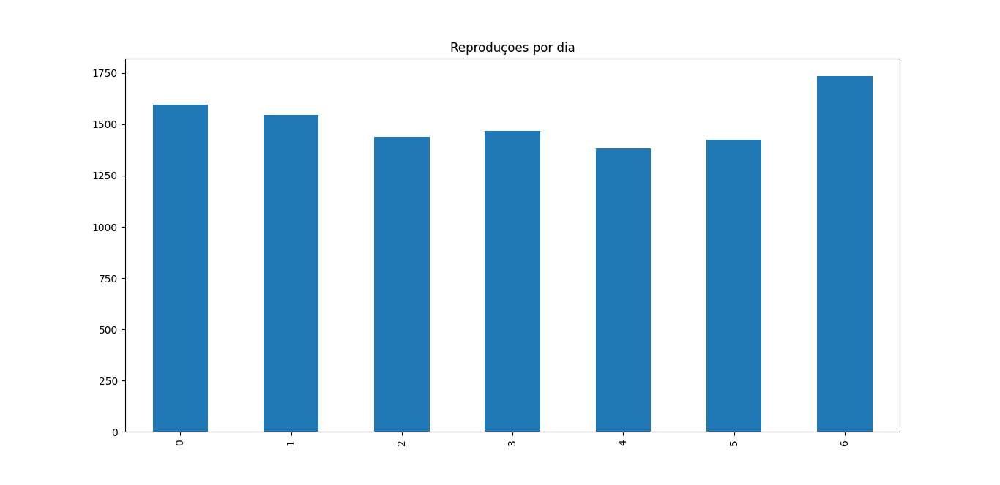
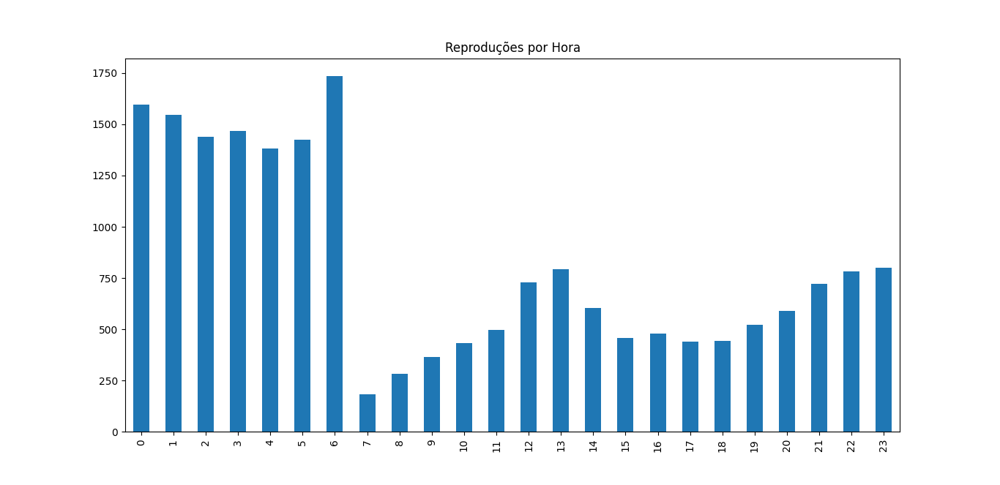

<h1>Análise dos dados de minha conta Netflix</h1>

<h2>QUESTÕES NORTEADORAS</h2>
    <ul>
    <li>Qual horário eu mais assisto? </li>
    <li>Qual dia da semana eu mais assisto?</li>
    <li>Quanto tempo cada perfil já passou assistindo?</li>
    </ul>

<h2>ETAPAS DO PROCESSO</h2>
    <ul>
    <li>Requisição dos dados para o netflix</li>
    <li>Familiarização com os dados
        <ul>
        <li>Netflix fornece uma serie de arquivos csv com diversas informações, dentre eles o que me traz os dados que irei utilizar para a análise é um chamado de <i>ViewingActivity.csv</i>.</li>
        <li>Abrindo o arquivo no excel todos os dados vem separados por vírgula em uma mesma coluna, poderia neste ponto fazer o tratamento de dados no proprio excel mas o volume de dados torna inviável com o hardware dísponivel pois o arquivo possui (29870, 10); (linhas, colunas)</li>
        </ul>
    </li>
    <li>Preparação dos dados
        <ul>
        <li>Excluir colunas irrelevantes para análise ('Country', 'Attributes', 'Supplemental Video Type', 'Device Type', 'Bookmark', 'Latest Bookmark')</li>
        <li>Ajustar o tipo dos dados fornecidos para possibilitar análise, algumas informações vieram listadas como objetos, então foi preciso transformar para string de modo que a análise fosse possível</li>
        <li>O tempo de execução é dado em UTC, então foi preciso transformar para o horário local</li>
        <li>Em uma primeira vista dos dados podemos ver que os trailers e previews de episódios são contabilizados, mas para esta análise não irei incluir esses dados, então foi preciso filtra-los. Excluindo qualquer reprodução que seja menor que 2 minutos.</li>
        </ul>
    </li>
    <li>Analisando os dados
        <ul>
        <li>Somando as durações das reproduções de cada perfis resulta em um total de 434 dias 21:00:49</li>
        <li>Analisando as durações de cada perfil cheguei em:  
            Total de tempo assistido por Alex =  188 days 20:39:08  
            Total de tempo assistido por Deborah =  81 days 07:33:06  
            Total de tempo assistido por Tônia =  45 days 22:50:48  
            Total de tempo assistido por Manuela =  87 days 19:07:50</li>
        <li>Observando o gráfico o dia que eu mais uso a Netflix é no domingo
        
        </li>
        <li>Observando o gráfico a hora que eu mais assisto é as 6 horas da manhã e de madrugada a hora que eu mais tenho reproduções, o que me leva a crer que há algum erro no mudança de fuso horário.
        
        </li>
        </ul>
    </li>
    </ul>
        
<h2>MELHORIAS POSSÍVEIS</h2>
    <ul>
    <li>Verificar mudança de fuso horário para ver se está correto e alterar gráficos de acordo necessidade</li>
    <li>Incluir novas questões como:  
        Quantas horas no minimo de uso seria necessário para compensar o preço da mensalidade? 
        Qual serie assisti por mais tempo? 
        Qual filme vi mais vezes? 
        Qual perfil passou mais tempo assistindo uma coisa só?</li>
    <li>Criar um dashboard com os dados</li>
    </ul>

<h2>Projeto em andamento, mais atualizações em breve</h2>
        